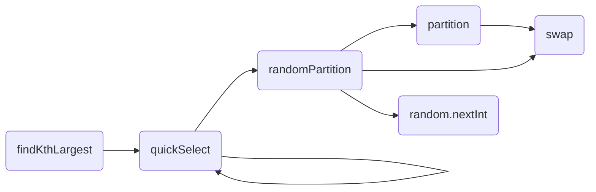

# <!-- 双指针 -->

## 424. 替换后的最长重复字符

输入：字符串 s，全部是大写字母； 整数 k

要求：最多可以将字符串s中的任意 k 个字符进行替换

输出：最长重复字符的数量

---

### 官方题解

官方题解的方法确实很妙：


如果该数值大于 k ，自然是不符合题意，那么右指针移动，左指针也移动：


如果数值小于等于 k，那么说明符合题意，右指针移动，左指针不用移动：


右指针 - 左指针 就是最长重复子字符串的长度

**问题在于，怎么计算区间内非重复字符的数量？**

<!--more-->

从代码来看，每次移动右指针后，都是以右指针的新字符作为标准，认为该字符就是最多的字符

> 参考：https://leetcode-cn.com/problems/longest-repeating-character-replacement/solution/ti-huan-hou-de-zui-chang-zhong-fu-zi-fu-eaacp/
>
> 该回答中的第二个小问题似乎回答了这一点

如果右边界读到了移出左边界的字符，那么最长子串得以被正确维护

如果右边界不是移出左边界的字符，要让子串更长，总长度肯定要比之前的值还要长，也不会错过最优解

这个回答还是稍微有点拐弯。

> 还有一个细节，就是再移动左端点的时候，当然也会把左端点排除出去
>
> 也就是说永远只统计区间内各数值的情况

**此外，如何更新最长子串长度值maxCount？**

这要对比右端点的重复情况与当前最大子串长度

## 42. 接雨水

输入：一个整数数组，表示的是一些柱子的高度

要求：如果两根高柱子之间有矮柱子，或者有空隙，那么就可以存储雨水

输出：总共能够存储的雨水的最大量是多少


**本质**：

对于每一个位置，需要知道该位置左边的最高高度，和右边的最高高度，像木桶原理一样决定了当前位置能够存储的水量

**暴力解法**：

每到一个位置，进行遍历

**稍微优化**：

那就是先通过遍历的方法记录每一个位置左侧的最大值，反向遍历记录每一个位置右侧的最大值

如果该位置确实有空间，就可以计算出可以增加的水量

**双指针方法**：

这个方法确实很妙

（1）其实决定一个位置水量的，是最短的木板，比如说一个位置的左右都有高木板，近处的木板可能比远处还要高，但是这其实并不是很影响此处的存水量


比如上面这张图的位置5：右侧，7位置可能比位置10还要高，但是从位置10就能看出，5位置至少可以存放2个单位的雨水

（2）边界处的存水量，其实只需要一个短边就能判断

比如上面的图片，left位置能不能存放雨水，我们可以简单比较一下 leftmax 和 rightmax，发现 leftmax 更小，那么leftmax就是影响更大的“短板”——minVal

而且因为这个短板更靠近左边，所以对 left 位置影响更大，需要考虑left位置的情况，而不需要考虑 right 位置

> 关键因素是，在考虑left位置的时候也需要对leftmax进行调整
>
> 如果这个时候考虑 right 位置，那么可能需要 rightmax 的值，这是不太明智的（太远了）

所以这样，每一次移动时：

我们需要对比左右两端，找出影响比较大的短板；

找出短板影响比较严重的一端（左还是右），在这一端对比短板大小和当前值的大小，看能不能存储雨水；

不管能不能存储雨水，我们都需要对 当前端的max值（leftmax或者rightmax）进行更新，并且移动端点；

最后当两个端点移动到中间的时候，就说明这一次遍历结束了，获得了想要的结果。

## 19. 删除链表中的倒数第N个结点

目标有2：

- 删除倒数第N个结点【单向链表，不太可能反向进行遍历】
- 返回头节点【如果去掉的就是头节点，所以不能直接把原来的头节点返回】

要求：

- 只扫描一次

问题是：单向链表，怎么样实现只扫描一次呢？

> 没想到，这也是一个双指针的问题

使用两个指针，一个快，一个慢

或者说保持它们之间的距离 为 n-1【n代表要删除的节点的倒数顺序号】

那么当 一个节点移动到末尾的时候，另一个节点就移动到要删除的倒数第n个节点上了！【妙啊】

为了更好地删除，还可以添加 **哑结点** 【也就是在head前的节点，指向head，这个方法确实很常用】，这样的话第二个节点就可以指向要删除的节点的前一个节点

---

还有一个更绝的解答

```C++
class Solution {
public:
    int cur=0;
    ListNode* removeNthFromEnd(ListNode* head, int n) {
       if(!head) return NULL;
       head->next = removeNthFromEnd(head->next,n);
       cur++;
       if(n==cur) return head->next;
       return head;
    }
};
```

我现在看懂了

单向链表确实没有办法实现倒序的遍历

但是上面这个的做法就是每次到底，到底一次，cur+1，所以就相当于是实现了一个倒序的遍历，只不过递归套循环，时间上可能不占优势

---

传统方法是

先对链表遍历一遍确定总长度

然后再遍历链表，删除要删的那个节点就好了

---

按照以下几个步骤，应该默写出代码：

（1）定义一个新的头节点【其实是哑节点】

（2）定义两个指针，第一个动起来，直到两者间距达到要求

（3）两个指针都动起来，直到第一个指针到结尾了

（4）链表的删除就是，指向删除元素的下一个元素，那么被删除的元素自然就没有了

（3）最后还要把新增的节点删除掉

## 75. 颜色分类

输入：一个数组，其中只有三种整数：0，1，2

要求：进行排序，原地排序，最终结果应该是 所有 0 在最前面，然后是 所有的1，最后是所有的2

那么首先上来就能找到的一个想法是：

- 找到0就放到最开头
- 找到2就放到结尾

这不就解决了排序的问题了

但是问题是会多用空间

所以有两个方法：

### 单指针

这个方法虽然需要遍历两遍，但是是基础思路，很值得学习

我们设定一个 str 指针，指向所谓的开头

然后从 i = 0 开始遍历数组，如果找到了 0，那么就和开头 str 进行交换，然后 str +1，这样就能保证 比str 小的部分都是0 了

然后再遍历一遍，这次找1，str不要变，让str-1到xx之前都是1，就完成了

```python
str = 0
i = 0
while i < len(nums):
    if nums[i] == 0:
        swap(nums, i, str)
        str += 1
    i += 1
i = str
while i < len(nums):
    if nums[i] == 1:
        swap(nums, i, str)
        str += 1
    i += 1    
```

注意细节： 第二次遍历，还是要从 str 开始，这一位并没有完成排序


### 双指针

接下来是双指针，只需要遍历一次

这是我第一次再做题的过程中主动想到双指针

但是又放弃了

接着上面的方法，如果我们有两个指针，一个 p0 指向开头，一个 p2 指向结尾

然后，找到 0 就插入到开头位置，找到 2 就插入到结尾的位置，这样就达到了我们想要的效果

但是：

和结尾换位置一定要小心，比如我们找到了 2， 和结尾换了位置，原本结尾这个数值换到了 i 的位置

如果直接让 i+1，那么这一个数值就不会再被计算了！！！！

所以，必须要让 新的 i 位数值，继续和新的结尾（str-1，也变化了）比较

直到找到 数值的正确位置为止

```python
class Solution:
    def sortColors(self, nums: List[int]) -> None:
        """
        Do not return anything, modify nums in-place instead.
        """
        p0, p2 = 0, len(nums)-1
        i = 0
        while i <= p2:
            while i <= p2 and nums[i] == 2:
                # 对 nums[i] 需要不停交换
                nums = self.swap(nums, i, p2)
                p2 -= 1
            if nums[i] == 0:
                nums = self.swap(nums, i, p0)
                p0 += 1
            i += 1

    def swap(self, nums, i, j):
        nums[i], nums[j] = nums[j], nums[i]
        return nums
```


## 60. 第k个排列

给出一个数字n，那么从1到n的数字，拍成一个含有n个数字的数字，有$n!$ 种排列情况【按照大小顺序排列的】

【题目中限定了n:1-9】

输出第k个排列

---

这是一个数学问题

比如说如果我知道了

$n!,(n-1)!...2!,1!$

那么是不是一定可以解决这个问题？

`k/(n!)` 是本位的大小，余数是剩下的数量，当 n 比较大的时候，这种除法还是比较麻烦的 

然后 $(n-1)!=n!/n$ 这样，计算也不会太复杂

---

看答案题解，有点妙：

```python
valid = [1] * (n + 1)
for j in range(1, n + 1):
    order -= valid[j]
    if order == 0:
        ans.append(str(j))
        valid[j] = 0
        break
```

这里的order就是我说的计算出来的本位的大小，但是不是直接就是我们要的数字了，而是剩下的数字里面按顺序的一位数字

这里的方法是使用了valid数组做连接，如果某一个数字已经被用了，那么valid那一位就是0，这样的话，order就会滑过该数字，就完美地实现了不重复取数的想法

是非常妙，但是这个算法也有点难以想出来

---

最后一点细节：

- 其实这道题并不需要 n的阶乘，只需要 n-1 的阶乘
- 为什么 k 要减 1 ？
  - 因为第k个排列的首位数字是 $a_1 = \frac{k-1}{(n-1)!}+1$

# <!-- 分治 -->

## 215. 数组中第K个最大的元素

复习

欣赏官方给出的java语言的题解，主要是学习 分治思想的应用：[数组中的第K个最大元素-官方题解](https://leetcode-cn.com/problems/kth-largest-element-in-an-array/solution/shu-zu-zhong-de-di-kge-zui-da-yuan-su-by-leetcode-/)



主函数：`findKthLargest()` 

- 直接调用 快速排序 函数

快速排序函数：`quickselect()` 参数比较多

- a - 待排序的数组
- l - 左侧个数
- r - 右侧个数
- index ： len -k 就是说我们现在要找的数值，它的索引应该是 len-k

该函数调用了 `randomPartition()` 函数：作用是

- 首先 调用 `random.nextInt(x)` 生成一个范围在 0-x 内的任意正整数
  - 这里使用的方法是 `i = random.nextInt(r-l+1)+l`
  - 这里 `r = len -1`，那么这个 random 最后就是大于 l 的一个随机数值
  - 也就是说这里随机选择呢右侧的一个 位置
- 然后 `swap(a, i, r)` 就是把 `a[i]` 和 `a[r]` 互相调换位置
  - 注意这里，i 比 l 要大，一定在当前值的右边
  - 而 r 可能是从 len -1 开始进行计算的
- 接下来交给 `partition` 函数

说实在的，这个官方的题解一点都不容易看懂

---

还是看一下第三方的题解：https://leetcode-cn.com/problems/kth-largest-element-in-an-array/solution/partitionfen-er-zhi-zhi-you-xian-dui-lie-java-dai-/

这个清晰多了

主代码：

```java
while(true){
    int index = patition(nums, left, right);
    if (index == target){
        return nums[index];
    }else if (index < target){
        left = index + 1;
    }else {
        right = index - 1;
    }
}
```

非常契合思想，那就是如果索引小了，那就查看右边，如果索引大了，就看左边

下来关键就是看这个 partition 函数，它的作用是给 nums 做一个排序，最后返回想要的 索引值

这个函数其实是对 [left, right] 区间的nums 进行操作

所以首先 找一个标准数 pivot， 比如 nums[left]，索引也放过来

然后 从 left 开始遍历，看 nums[i] 有没有比 left 小的

如果比 left 小，那肯定要把这个 nums[i] 和 nums[left] 交换一下了

**但是，这个程序巧妙的地方是** 

没有直接把 nums[left] 换掉

而是把 nums[left] 先排除在外，然后 把小的放在前面，大的放在后面，找到了一个中间位置 j，最后直接把 nums[j] 和 nums[left] 换一下就可以

就是说 [left+1, j] 都比 nums[left] 小了，(j, i] 都比 nums[left] 大，那么这个时候，就可以把 j 和 left 换一下，因为不会影响 j 位置处成功分割了左右两边，我们要的也是 这个位置 j 

> 注意这个地方， j++ 和 j += 1 是不一样的
>
> - 后面这个会直接运算，然后改变了 j 的值
> - 但是 j++ 是先用，再改变，所以暂时还没有改变

接下来，后面说了一个问题

最好是随机初始化 我们的 标准数 pivot，否则极端测试用例可能会很耗时间

一个方法是，随机交换 第一个元素和后面的任意元素

> 怪不得官方题解 上来就是一个随机交换，搞得莫名其妙
>
> 现在再回头看官方题解，就会发现其实是一样的了

# <!-- 贪心 -->

## 984. 不含AAA或BBB的字符串

输入：a 的数量m，b 的数量n

要求：写一个字符串，其中有 m个a和n个b，但是不能出现连续 3个a，或者 3个b

---

我自己的思路：

我曾在脑海中冒出过以下想法：

哈希表-斗地主问题 —— 发现问题在于不能顾头不顾尾

贪心算法 —— 想先找出所有的对a，然后往里面插入 b【超时了】

动态规划，不知道是不是

还想了双指针，但是不行

总的来说，贪心应该是的，但是应该怎么贪心

---

按我说的贪心算法：【首先假设 a 比 b 多】

先找出所有的对a：double_a = a // 2，余数 res_a 就是剩下的a【就是0或者1】

然后给b的位置就是：double_a + res_a

然后对b的数量是：double_b = b % (a_block - 1)

最后剩下的就是单个的b

【超时了】

> 这种方法可以称之为 插空法
>
> [贪心+插空](https://leetcode-cn.com/problems/string-without-aaa-or-bbb/solution/tan-xin-cha-kong-by-zhang191031/)
>
> 但是插孔的具体实现略有不同

---

姑且不说这个方法是不是正确的

其中一点确实是解题的关键： 找 a 和 b 中比较多的

但是我只找了一次

---

### 官方题解

（1）定调： 贪心算法

但是，下一个写入的字母应该是当前所剩最多的待写字母，除非前两个都是它了，才改用另一个字母

（2）确实使用 list，最后转 str

（3）我们说写a还是b看谁更多，怎么样知道是 a 多还是 b 多呢？其实不一定要知道 a，b 的数量，只要知道下一个 写 a 还是写 b 就好了

【所以就是来判断下一个是不是要写a】

比如这一句：`writeA = ans[-1]=='b'`

如果`ans[-1] `是 b，那么这个writeA就是true了，就表示确实要写A

还有：`writeA = A >= B` 

就是说，如果 A 比较多，那么就写 A

（4）一个大问题，不要把 b 和bb，a和aa 分开思考

把 两个 a看成和一个 a 是不一样的情况，是一种错误的想法，容易走上面向过程

而不是面向对象的道路

这样一来就简单多了：

```python
class Solution:
    def strWithout3a3b(self, a: int, b: int) -> str:
        ans = []
        while a or b:
            if len(ans) >= 2 and ans[-1] == ans[-2]:
                writeA = ans[-1] == 'b'
            else:
                writeA = a >= b
			# 根据是不是 写a，来进行填写
            if writeA:
                a -= 1
                ans.append('a')
            else:
                b -= 1
                ans.append('b')
            
        return ''.join(ans)
```

## 999. 可以被一步捕获的棋子数

这道题虽然是涉及二维数组，但是确实是一道简单题

问题描述：

国际象棋棋盘

R - 白车（只有一个），B - 白象（可能有），p - 黑卒（可能有）

白车可以四个方向移动：

- 如果遇到 黑卒，可以吃掉，然后停止
- 如果遇到 白象，停止
- 如果遇到 边界，停止

如果给了一张棋盘，请问在该棋盘上，可以被一步捕获的棋子有多少

---

分析，贪心法

首先要找到白色的车 - R

似乎没有什么好办法，就是遍历，最糟糕的情况 O(N)

然后分别遍历四个方向，每个方向一直到底：

- 如果 到边了，返回
- 如果 到B了，返回
- 如果 到p了，加1，返回

这里面的四方向遍历方法是我之前学到的，这样可以重用一部分代码：

```python
# 设置一个代表四个方向的数组
# 方法1：直接设置表达式，这样其实不容易继续
dirc = [[i+1, j], [i-1, j], [i, j+1], [i, j-1]]
# 方法2：设置步长，这个方法更好
dirc = [[1, 0], [-1, 0], [0, 1], [0, -1]]
for k in range(len(dirc)):
    x += dirc[k][0]
    y += dirc[k][0]
```

这样就实现了四个方向的遍历

接下来的判断过程其实比较容易，注意一个细节即可：如果遇到 黑卒-p，加 1 后也是需要进行返回的，否则会有问题

---

## 59. 螺旋矩阵 II

题目描述：

给一个正整数 n，可以用 1 到 n^2的所有元素，填满一个 nxn 的正方形矩阵

要求：

填满的顺序应该是螺旋的，比如：


---

贪心法：四方向 - 碰壁法

碰壁，改变移动方向

设置了四个方向的移动模式，这一点和 999 题（上面一题）是完全相同的

也需要进行模式切换，但是问题是什么时候需要切换模式呢？

---

方法一：贪心

- 到边界需要切换
- 原本要去的下一个位置有数字了需要进行切换

怎么样检测是不是到了边界？

- 现在的位置到了 n-1 ，说明是一个边界
- 下一个位置到了 n，说明是一个边界

怎么样检测下一个位置是不是0？

- 首先要按照原来的模式求出下一个位置的坐标
- 然后看下一个位置是不是0

这样一来，就需要先用一个假的位置 next_i，next_j先求一边下一个位置的坐标，并且同时判断是不是超出了边界，是不是0，好的一点是，这样可以直接进行模式的判断和修改

然后最后再对真正的位置 i，j 进行修改

---

方法二：数学

观察一下可以发现，每次进行模式的切换需要走过的长度是：

n, n-1, n-1, n-2, n-2,  n-3,  n-3, n-4, …, 2, 2, 1.

除了头和尾，其他位置都是需要走两个相同的长度

这个其实也是可以用循环去实现出来的

比如说，可以先出一个循环，能够写出上面的数组

此时，什么时候需要转换模式？

- 当每一条边写的数字的数量达到了数组中对应位置的数字，就说明这条边写完了，需要写下一条了

这种方法不需要判断下一个位置是不是满了，只需要计数，还是会占一点时间，但是空间上可能会小一点点

# <!-- 递归 -->

## 222. 完全二叉树的节点个数

给你一棵二叉树的根节点 root，求出该树的节点个数

比如：


输入： root = [1, 2, 3, 4, 5, 6]

输出：6

这个题的输入是 TreeNode，所以不能按照普通的数组进行对待

按照正常的递归方法，非常简单

```python
class Solution:
    def countNodes(self, root: TreeNode) -> int:
        if not root: return 0
        else: return 1 + self.countNodes(root.left) + self.countNodes(root.right)
```

只有2行代码

如果 root 是空，说明到底了，返回0

如果不是空，自身是一个节点 +1，然后计算左子树和右子树

完美通过


递归的空间占的大了一点，但是耗时还可以

---

观看题解：

1. 对于没有约束的二叉树，递归当然是没有问题的
2. 但是本题说的是 **完全二叉树**

**完全二叉树**

特点：叶子节点只出现在最后两层，最后一层如果不满，则叶子节点只在最左侧，或者是空树

如果是**满二叉树**，那么总节点数 =  2*h -1，h 是层数

所以完全二叉树最好是利用好结构特点

---

本次更新距离上次更新比较久，期间经过一系列的算法学习，有了一定的认识和进步，LeetCode刷题数量也已经达到了77题，目前正处于春招当中，继续加油吧！

