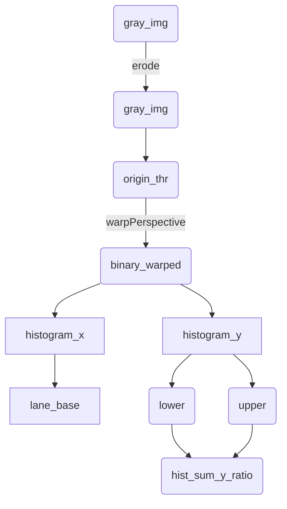

2020年华为无人车比赛，起始于6月底，至8月20日角逐出40支队伍参加半决赛，9月24日角逐出20支队伍参加决赛，26日最终决赛。有幸走到决赛现场，但是没有取得理想成绩，在此整理参赛笔记，希望来年一战！

## 分工

为了实现无人车的运行，本次赛事中本小组分为机器视觉（负责modelarts和hilens）、车道线识别、激光雷达等三个部分，本人负责车道线识别部分。

<!--more-->

## 车道线的识别

### 技术点

使用OpenCV进行视觉识别

排除斑马线的干扰

根据识别的车道线计算斜率，控制小车转向角度

### 主要技术方法

首先对图片进行处理：

转为灰度图 =》 转为二值图像 =》 计算一些最大值，确定两侧车道线的位置

使用直方图（histogram）方法，主要函数来自OpenCV包。

然后将窗口分割，从下而上计算车道线所在位置，并计算车道线的斜率。

车道线斜率的计算主要使用的是纯几何跟踪的方法。

## 难点一：斑马线

由于车道线识别的过程中主要是对图像中的白色像素进行判断，斑马线对车道线的识别有一定的影响。

如果检测到斑马线呢？看宽度是不是太宽吗？

- 当宽度比较宽的时候，可能就是到了斑马线区域
- 也有可能是一些反光区域
- 这个时候，首先需要保持之前的角度变换值不要随意改变
- 另外，降低反光，以及取右侧边缘进行检测

如果车道线横在了屏幕中间？这个首先需要避免车道线通过了视野的中间吧

应该将车辆的姿态信息和车道线的信息充分融合进行判断

> 参考：[python+opencv车道线检测（简易实现）](https://www.pythonheidong.com/blog/article/324414/)
>
> 我觉得这里面给的思路不错，就是看白色像素点所占的比例，来判断是不是斑马线
>
> 然后关于车道线直接绘制、mask掩块也有介绍，可以简单看一看
>
> [OpenCV检测斑马线](https://blog.csdn.net/dawn1227/article/details/64125542)

**问题：白色像素点的占比：**

首先二值区域的像素点以及找出来了

nonzero的大小也是有的

**那么下来就看一下斑马线处nonzero的值是不是过分偏大？**

然后通过这个方法增加一个阈值

但是似乎并不是真的偏大

python 获取列表中的最大值：`max(list)`即可返回列表list中的最大值

通过最大值判断右边界，仍然不完整，因为有可能右侧出现漏光等现象，那么这些白色像素点就是多余的，而不是所需要的了

==通过直接检测白色像素点的最大值，需要保证没有任何干扰，需要保证滤波效果==

对他们进行规避：

- 非全局采样
- 这些点是不是集中在某个角落，考虑进行分离
  - 例如可以使用黑色遮盖
  - 或者使用**霍夫变换**进行**识别后分割**

**突然想到一个问题，我确实可能没有办法识别弯道，但是我可以识别直线的车道线，然后把它盖住**

新方法：使用霍夫变换检测直的车道线，并将其遮盖

> [简易车道线识别（图像与计算机视觉）](https://www.jianshu.com/p/15e3f9d8c121)
>
> 本文思路：
>
> 1. 获取图像
> 2. 调整大小
> 3. MySetting类：初始化
>    1. 做了一些画图错做
>    2. 高斯滤波
>    3. Canny边缘检测
>    4. roi区域
>    5. open和close
>    6. huogh检测
> 4. 找出左右车道线，霍夫变换确定直线的斜率，确定直线，画图
>
> 比较感兴趣的是ROI区域的选择，很有意思
>
> `ROI_Based_Edge_Filtering()`
>
> 膨胀和腐蚀基本上是一样的

### 霍夫变换

**检测直线：**

这个霍夫变换有点意思，就是过每个点的直线的斜率和截距构成一个二维区域，如果某些点的区域刚好重合在这个点，那么这些点就在该点的斜率和截距所代表的直线上

**检测圆：**

三点可以确定一个圆

以这三点做所有半径的圆则必有一个公共交点，这个交点就是 以此三点为圆的圆心

霍夫圆检测对噪声比较敏感，首先要对图像做中值滤波

#### 步骤

（1）**使用霍夫检测对整体进行了检测**

输出了画有结果直线的图像，但问题是得出的所需要的线不足，尤其是边缘检测出来的线据称情况过于严重

**（2）调整霍夫检测的参数，增加中值滤波**

通过调试，首先找出斑马线上独特的点：

这里我专门取了斜率为负值的点，从而将他们画出来

横向斑马线以 -1 为主要斜率

纵向斑马线的斜率也都主要是 1，这没有办法使用

但是还有一点问题：

1. 离群点或者直线的剔除
2. 横向线好判断，但是竖向的线不好判断

**（3）然后找这些点的包络点**

找四个点：

x 最大的 - 右上角

x 最小的 - 左下角

~~**y 最大的 - 右下角 - 这个点可以不要，直接按上面的线向下覆盖到最低端**~~

y 最小的 - 左上角

注意离的太远的不能要！就是右下角那里

然后把包络点区域内全部涂黑

问题是：

- 怎么样找到所需的点？

np.array 类型的变量 - lines没有index方法， list有index方法

np.array类型的变量应该使用where方法

> 参考：[找出numpy array数组的最值及其索引](https://www.cnblogs.com/nxf-rabbit75/p/10073916.html)
>
> [查找列表中某个值的位置（python）](https://blog.csdn.net/lcl497049972/article/details/89386293)
>
> [使用python中的max函数找到最大值](https://www.runoob.com/python/func-number-max.html)

- 离群点的去除

可能需要加大阈值，但是说真的没有看到阈值的效果

**最后使用的方法**

- 将所有检测出的特征点的x和y坐标分别放入列表
- 然后按照所需寻找想要的点
- 最后根据找出的点进行画图

**问题是感觉计算量一下子大了很多**

比较明显的区域：

直接可以把斑马线去除，但是这个地方其实不是很影响

真正比较有影响的是出斑马线的部分，遮盖有效果

原图 =》 binary_wraped =》 canny边缘检测 =》 霍夫直线检测 =》 黑色覆盖斑马线区域

**接下来，调整霍夫变换，避免边缘点的检测**

> 本质问题上，车道线的目标是提速，能够提升速度的情况下，仍然能够流畅地运行

## 难点二：IMU的使用

IMU - 惯性测量单元

测量物体三轴姿态角（或角速率）以及加速度的装置，一般来说，IMU安装在被测物体的重心上，用字啊需要进行运动控制的设备上，也用在需要用姿态进行精密位移推算的场合

在串口节点中发布的有关超声波和IMU消息的主题：

类型都是 int32 的类型，但是单位也各有不同

| 话题                        | 意义         | 单位          |
| --------------------------- | ------------ | ------------- |
| /vcu/ActualMotorSpeed       | 实际电机转速 | 转/s          |
| /vcu/ActualVechileMode      | 实际挡位信号 |               |
| /vcu/ActualVechileDirection | 实际方向     |               |
| /vcu/SupersonicDistance     | 超声波距离   | mm            |
| /vcu/aX                     | IMU加速度X   | g 重力加速度  |
| /vcu/aY                     | IMU加速度Y   | 重力加速度    |
| /vcu/aZ                     | IMU加速度Z   | 重力加速度    |
| /vcu/alphaX                 | IMU角速度X   | 度/秒         |
| /vcu/alphaY                 | IMU角速度Y   | 度/秒         |
| /vcu/alphaZ                 | IMU角速度Z   | 度/秒         |
| /vcu/BX                     | IMU磁场X     | mGS（毫高斯） |
| /vcu/BY                     | IMU磁场Y     | mGS           |
| /vcu/BZ                     | IMU磁场Z     | mGS           |
| /vcu/thetaX                 | IMU角度X     | 度            |
| /vcu/thetaY                 | IMU角度Y     | 度            |
| /vcu/thetaZ                 | IMU角度Z     | 度            |
| /vcu/batteryVoltage         | 电池电压     | V             |
| /vcu/motorTemperature       | 电机温度     | 摄氏度        |

> 参考：
>
> [移动机器人轮式里程计](https://blog.csdn.net/u013468614/article/details/106724804?utm_medium=distribute.pc_aggpage_search_result.none-task-blog-2~all~first_rank_v2~rank_v25-16-106724804.nonecase&utm_term=imu%E9%87%8C%E7%A8%8B%E8%AE%A1)
>
> [里程计航迹推演与IMU预积分](https://blog.csdn.net/hzwwpgmwy/article/details/85086393?utm_medium=distribute.pc_aggpage_search_result.none-task-blog-2~all~first_rank_v2~rank_v25-1-85086393.nonecase&utm_term=imu%E9%87%8C%E7%A8%8B%E8%AE%A1)
>
> [IMU与里程计融合](https://blog.csdn.net/baimei4833953/article/details/80768762)
>
> [从零手写VIO——（三）基于优化的 IMU 与视觉信息融合（下篇）](https://zhuanlan.zhihu.com/p/164778891)
>
> VIO相关知识