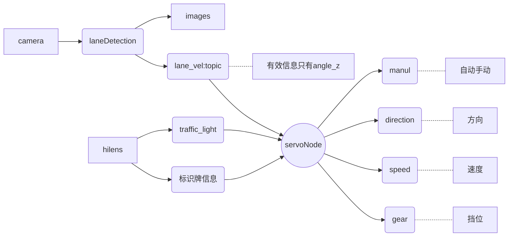

上一篇主要内容是针对本赛事中的重难点进行描述，但是针对实际问题，需要更加细致的调整。

本文记录实际调试过程中遇到的问题和改善方法。

<!--more-->

## 问题记录

### 1. 首先需要调整透视变换视角

主要是画面范围的调整。

由于弯道比较多，真实小车的视线中很少能看到两条线；同时，大概是因为选择透视变换的范围比较小，无法覆盖到需要的图像区域。因此需要对画面进行调整。

**直接用openCV添加直线**

> 可能出现的问题：
>
> `SystemError: new style getargs format but argument is not a tuple`
>
> 这个问题应该关键是数据的类型不太对

效果如图所示，大概明白如下：前面的区域界定，只是计算转换矩阵，然后使用转换矩阵把整个图片进行转换。

所以说，**转换矩阵要谨慎一点**，不是随便怎么转换都可以的。

那么我们应该怎么样转换呢？让比例更加准确一点！

这张图应证了我的想法，确实需要**调整好直线道路上的透视变换效果图**。

> 本赛道转弯比较多
>
> 按道理来说，按照透视的原理，只要将一个水平的梯形区域转换为一个正常的方形区域就可以了
>
> 但是现实是，本赛道弯道多，车身倾角大，导致车的姿态情况不是水平，最好有一点偏角
>
> 应该是左低右高的一个区域就比较好

**原始区域：**

变换前：`src_points = np.array([[3,570], [387,460], [906,452], [1041,485]], dtype="float32")`

变换后：`[266., 686.], [266., 19.], [931., 20.], [931., 701.]`

该区域的问题是，没有线的区域会比较多，或者说覆盖的车道区域有点小

从形状上来看倒是很符合左低右高的形状

**区域1：**

变换前：`src_points = np.array([[3,570], [387,460], [1106,472], [1241,520]], dtype="float32")`

其实这个区域还不错

对中间的纯黑地带过滤也比较到位

就看实际中的表现如何

> 不对，这个确实应该动态进行调整
>
> ==车身姿态影响到了拍摄角度==
>
> 左转的时候应该是坐地右高，右转的时候则是要右低左高了，目前这样肯定是不够的
>
> 如果按照IMU的数据去调整呢

**区域2**：

变换前：`src_points = np.array([[3,520], [387,470], [1106,472], [1241,520]], dtype="float32")`

我使用opencv将视频转换为图片，然后用matplotlib展示出图片，然后进行分析

目前看完了全部代码之后，就很明朗了

就是要不断调整透视变换的比例，从而确保在直线道路上，能够调试出满意的透视变换图像

---

==观察结果：==

按照最后的观察结果来看，右转问题有二：

第一，其视角偏上，那么近一点的区域就会反应过于灵敏

- 这个调整的是转换前的区域大小，以及转换后的区域的大小

第二，如果角度变换的速度太慢，就会没有转到有线的位置，从而丢失车道线画面

- 这里调节角度变换的速度，一个是调整==计算`cmdSteer`的系数k==，基准是 -19，**这个数字是什么意思呢？**
- 这个数字应该是弯道的斜率，不同的弯这个系数确实是不太一样的

**其实比较好奇，什么样的结果算是改动成功？**

结果就是应该准确快速地转弯成功

### 2. midPoint

midpoint理论上是视野的中点，但是程序中是 320，这个是有点奇怪的，偏左了一点点

- 回答：程序中有两个midPoint，一个是midPoint_x，这个值是640，已经确定，没有问题
- 还有一个是midPoint_y，似乎是用以分隔上下部分，这个值目前定的是320，实际上也可以进行调整，主要还是看车道在画面中所占的位置

这个值感觉不是特别需要改动

或者说修改的意义不大

### 3. 视频录制

使用opencv-python录制视频

首先使用的代码参考：[Python-OpenCV视频录制](https://blog.csdn.net/hhaowang/article/details/88236612)

但是这个一点都不好用，录制的视频播放速度极快，丢帧也比较严重了

接下来希望参考：[Python -opencv 录制视频](https://blog.csdn.net/weixin_43635647/article/details/103774559)

这个代码看起来要简洁一点

### 4. 入弯出弯测试

目前来说，右转入弯要么不够迅速，要么会提前（主要还是看视野内的车道线情况）

左转入弯有问题，似乎是机械方面的故障，从信号上来说已经是左转了，但是实际转弯情况却是右转的

目前的参数中：

**转向参数设为 -21**

效果不错，右转弯很合适，左转弯尚有不足

速度调至10很完美，速度调至15稍有不足（主要是左转弯时会打方向比较急、猛）

### 5. 斑马线识别

怎么样将最边上的线识别出来呢？

用了边缘检测，效果尚可，但是怎么样压制其他区域呢？

首先查看了lanebase点的位置，可以看的出来，在这之前的一小段高曝光中，会对lanebase产生一点影响

此时lanebase做了什么

当前使用的解决方法涉及两个参数;

- 白色像素占图像的比例：大于0.083
- lane_base中心值只要小于900，就会自动加500，保证向左转弯过车道线

> 我认为该问题中的关键是lane_base位置的错误，导致了车道曲线的识别问题
>
> 因此我的两种方法：
>
> - 根据lanebase的突变情况，使用黑色色块进行掩盖
> - 根据lanebase的突变情况，对lanebase进行修正
>   - 其实第二种修正情况，有一定的问题，那就是一刀切全部加了500，这个不是非常合理
>   - 但是我发现nonzerox的值似乎和我设想的不太一样【nonzerox要配合nonzeroy来同时查看，nonzeroy是从0到720，nonzerox则也是要跟着nonzeroy的像素值进行变化】也不对，不需要直接进行索引，直接求最大值也是可以的

#### 新方法

使用霍夫变换检测斑马线的两侧横线，然后求凸包的顶点，将凸包内的斑马线直接去除，该方法在视觉效果上还是不错的

**测试参数表：**

各参数含义：

- rho：
- theta：
- threshold：
- min_line_length：
- max_line_gap：

| rho  | theta     | threshold | min_line_length | max_line_gap | 效果                                 |
| ---- | --------- | --------- | --------------- | ------------ | ------------------------------------ |
| 1    | np.pi/180 | 30        | 30              | 30           | 出现的线条会很少                     |
| 1    | np.pi/180 | 50        | 30              | 1            | 出现线条多，很多小线条以点的形式出现 |
|      |           |           |                 |              |                                      |

### 6. 滑动平均问题

关于servoNode中的滑动平均值，之前确实没有过多考虑，可能还是希望能就原状进行测试，但是忽略了代码间的相互协调能力

这个 n 值的设定主要是起到滑动平均的基数的关系

如果调整n，发布的速度也会比较慢，但是也需要可以起到比较好的光滑的效果（不见得）

需要尝试一下，目前设想的测试顺序如下所示：

| n=   | 1                        | 5                                      | 3    | 10   |
| ---- | ------------------------ | -------------------------------------- | ---- | ---- |
|      | 抖动比较明显，但是可过弯 | 抖动降低，但是人行道不易通过，转角过大 |      |      |

### 7. 整体规划首个思路

**起步**

由于是绿灯开始后才进行运动，因此可以在运动的开始添加一个延时，在此延时中将无人车的运动方向设置为50，可以稍微加快速度

**左转弯**

使用视觉进行检测，几乎不需要进行干扰

**人行道**

可以通过opencv或者是hilens进行识别

- 在此位置需要停车

可以通过激光雷达检测到右侧的距离，检测行人等障碍物

- 此时应该判断是不是处在左转弯的过程中？【或者说怎样让它具有独特性，而不是全赛道通用的】
- 需要判断障碍物是不是消失，障碍物的级别最高，高于人行道，高于车道
- 检测到障碍物时：方向设置为50，挡位设置为空，避免来回的摆动

**重新启动**

- 应当保持停车前的运行方向不变
- 检测重新启动后的小车运动方向
- 重新可以设置方向和挡位（也就是说在斑马线期间视觉确实也是在启动的，只不过不能修改方向值）

**交叉区域**

激光雷达slam，可以在中间交叉区域通过判断两边距离是否一致从而实现

**右转弯**

视觉可以实现比较好的操作

**限速操作**

我们把限制后的速度调整为10，限速前应当能够按照15-20进行运动

注意限速和转角之间的配合关系，需要进行测试

这边转弯的过程中限速和转角是不是能很好地进行配合

**停车**

首先识别到黄灯，开始进入停车识别

然后识别车的位姿，是不是和右侧挡板平行（使用激光雷达）

满足和右侧挡板平行，或者能够保持一定的距离，进行驶入

最后当看不到黄灯、或者红灯后，进行延时，从而确保停车完毕

- 注意不能压线，不能碰挡板

### 8. /scan话题无法读取的问题

> 参考：[ROS多机通讯踩坑，（主机和从机之间可以订阅话题，但是看不到话题消息）](https://blog.csdn.net/qq_38441692/article/details/98205852)
>
> [**rostopic list works but rostopic echo does not**](https://answers.ros.org/question/48240/rostopic-list-works-but-rostopic-echo-does-not/)

该问题已经解决，使用/rosout进行读取